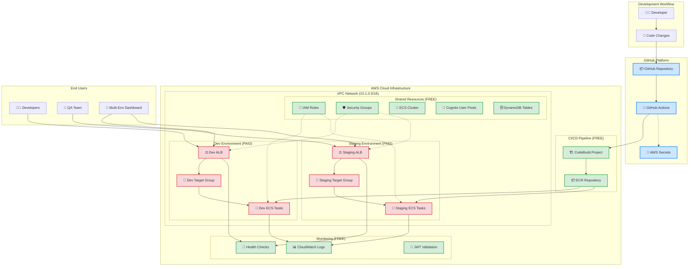

# 🎯 TaskMaster SaaS Platform - Deploy App on AWS ECS

[](https://aws.amazon.com/ecs/)
[](https://www.docker.com/)
[](https://flask.palletsprojects.com/)
[](https://aws.amazon.com/cloudformation/)
[]()

> A complete multi-tenant task management application demonstrating modern AWS architecture patterns, cost optimization strategies, and real-world SaaS development workflows.

## 📖 Table of Contents
- [🎯 Project Overview](#-project-overview)
- [🏗️ Architecture](#️-architecture)
- [💰 Cost Breakdown](#-cost-breakdown)
- [🚀 Quick Start](#-quick-start)
- [📁 Project Structure](#-project-structure)
- [🔧 Troubleshooting](#-troubleshooting)
- [📚 Learning Outcomes](#-learning-outcomes)
- [🤝 Contributing](#-contributing)

## 🎯 Project Overview

**TaskMaster** is a production-ready SaaS task management platform that helps companies manage projects, assign tasks, and track team productivity through a web-based dashboard with real-time updates and analytics.

### ✨ Key Features
- 🔐 **Multi-tenant Architecture** - Secure company data isolation with Cognito
- 📊 **Real-time Dashboard** - Live project and task updates
- 🚀 **Serverless Containers** - ECS Fargate for scalability
- 💰 **Cost Optimized** - Deploy/delete daily workflow saves 90% costs
- 🔄 **Full CI/CD Automation** - GitHub Actions + CodeBuild + Multi-Environment
- 🎭 **Multi-Environment Pipeline** - Dev + Staging environments
- 🌐 **CORS Enabled** - Browser-friendly API access
- 📊 **Environment Comparison** - Side-by-side dashboard
- 🔑 **JWT Authentication** - AWS Cognito user management
- 🗄️ **NoSQL Database** - DynamoDB for scalable data storage
- 👤 **User Management** - Signup, login, company isolation

## 🏗️ Architecture

### Multi-Environment CI/CD Architecture


### Cost-Optimized Multi-Environment Design
```
🆓 GitHub Actions → 🆓 CodeBuild → 🆓 ECR (500MB) → 🆓 ECS Cluster
                                    ↓
              📊 Automated Multi-Environment Deployment
                                    ↓
        🔧 Dev Environment                    🎭 Staging Environment
              ↓                                    ↓
        💸 Dev ALB (~$16/month)              💸 Staging ALB (~$16/month)
              ↓                                    ↓
        💸 Dev Fargate (~$5/month)           💸 Staging Fargate (~$5/month)
              ↓                                    ↓
        🆓 Cognito User Pool (50K users)    🆓 Cognito User Pool (50K users)
              ↓                                    ↓
        🆓 DynamoDB (25GB Free)              🆓 DynamoDB (25GB Free)
              ↓                                    ↓
        🆓 CloudWatch Logs (5GB Free)       🆓 CloudWatch Logs (5GB Free)
              ↓                                    ↓
        📱 Authenticated Dashboard           📱 Multi-Env Dashboard

💰 Daily Cost Control:
├── 24/7 Multi-Environment: ~$42/month
├── Daily Demo (8 hours): ~$4.20/month (90% savings)
└── Dev Only: ~$2.10/month (95% savings)
```

## 💰 Cost Breakdown by Service

| Service | Monthly Cost | Free Tier | Notes |
|---------|-------------|-----------|-------|
| **VPC** | $0 | ✅ Always Free | VPC, subnets, route tables, IGW |
| **IAM Roles** | $0 | ✅ Always Free | No charges for IAM roles/policies |
| **ECR** | $0 - $0.50 | ✅ 500MB Free | $0.10/GB after free tier |
| **ECS Fargate** | ~$5 | ❌ No Free Tier | 0.25 vCPU, 0.5GB RAM |
| **ALB** | ~$16 | ✅ 750hrs Free | $16.20/month + $0.008/LCU-hour |
| **Cognito** | $0 | ✅ 50K MAUs Free | User authentication and management |
| **DynamoDB** | $0 - $2 | ✅ 25GB Free | NoSQL database with auto-scaling |
| **CloudWatch Logs** | $0 - $1 | ✅ 5GB Free | $0.50/GB ingested after free tier |
| **Data Transfer** | $0 - $2 | ✅ 1GB Free | $0.09/GB after free tier |

**Total Estimated Cost: ~$8-13/month** (depending on usage)

## 🏗️ Infrastructure Components

### 1. VPC Network Architecture (vpc.yaml)
**Purpose**: Secure, isolated network for TaskMaster application

**Network Layout**:
```
TaskMaster VPC: 10.1.0.0/16
├── Public Subnets (ALB + ECS)
│   ├── 10.1.1.0/24 (AZ-1) - Load Balancer & ECS tasks
│   └── 10.1.2.0/24 (AZ-2) - Load Balancer & ECS tasks
└── Private Subnets (ECS with public routing)
    ├── 10.1.11.0/24 (AZ-1) - ECS tasks
    └── 10.1.12.0/24 (AZ-2) - ECS tasks
```

**Cost Optimization**: No NAT Gateway (~$32/month saved) - ECS tasks use public subnets with security group restrictions

### 2. IAM Security Roles (iam-roles.yaml)
**Purpose**: Secure access control for different components

#### 🔐 ECS Task Execution Role (`dev-ecs-task-execution-role`)
- **Used by**: ECS service during container startup
- **Permissions**: Pull Docker images, write logs, fetch secrets
- **When**: Container deployment and runtime management

#### 🔐 ECS Task Role (`dev-ecs-task-role`)
- **Used by**: Your running application code
- **Permissions**: Access Parameter Store, Secrets Manager
- **When**: App makes AWS API calls (database config, etc.)

#### 🔐 CodeBuild Service Role (`dev-codebuild-service-role`)
- **Used by**: CI/CD pipeline (GitHub Actions + CodeBuild)
- **Permissions**: Build Docker images, push to ECR, write logs
- **When**: Code deployment and image building

**Security Flow**:
```
1. Developer pushes code → GitHub Actions
2. CodeBuild (CodeBuildServiceRole) → Builds & pushes Docker image
3. ECS (TaskExecutionRole) → Pulls image & starts container
4. Running app (TaskRole) → Accesses AWS services
```

### 3. Authentication & Database (cognito.yaml, dynamodb-multi-env.yaml)
**Purpose**: Secure user management and scalable data storage

#### 🔑 AWS Cognito User Pools
- **User Authentication**: Email-based signup/login
- **JWT Tokens**: Secure API access with automatic expiry
- **Multi-tenant**: Company-based data isolation
- **Password Policies**: Configurable security requirements

#### 🗄️ DynamoDB Tables
- **Projects Table**: Company projects with GSI for querying
- **Tasks Table**: Project tasks with assignee indexing
- **Deployments Table**: Blue/green deployment tracking
- **Pay-per-request**: Scales automatically with usage

### 4. Core Services (Cost-Optimized)
- **ECS Fargate**: Container orchestration (0.25 vCPU, 0.5GB RAM) - ~$5/month
- **ECR**: Container registry (500MB free tier) - $0/month
- **ALB**: Load balancing (shared across services) - ~$16/month
- **Cognito**: User authentication (50K MAUs free) - $0/month
- **DynamoDB**: NoSQL database (25GB free) - $0/month
- **CloudWatch**: Logging and monitoring (7-day retention) - ~$1/month

### 5. CI/CD Pipeline
- **GitHub**: Repository hosting (free)
- **GitHub Actions**: Automated deployment (free for public repos)
- **CloudFormation**: Infrastructure as Code (free)
- **AWS CLI**: Service deployments (free)

## 📁 Project Structure

```
📦 Deploy-App-ECS-AWS/
├── 📂 .github/workflows/           # CI/CD Pipeline
│   ├── deploy.yml                  # Main deployment workflow
│   └── dev-deploy.yml              # Development deployment
├── 📂 app/backend/                 # 🐍 Flask API Application
│   ├── 📄 app.py                   # Main API with Cognito + DynamoDB
│   ├── 🐳 Dockerfile               # Container configuration
│   └── 📋 requirements.txt         # Python dependencies (boto3, PyJWT)
├── 📂 infrastructure/              # Infrastructure as Code
│   ├── 📂 cloudformation/          # CloudFormation Templates
│   │   ├── vpc.yaml                # Network foundation (FREE)
│   │   ├── iam-roles.yaml          # Security roles (FREE)
│   │   ├── ecr.yaml                # Container registry (FREE)
│   │   ├── ecs-cluster.yaml        # ECS cluster (FREE)
│   │   ├── alb.yaml                # Load balancer (PAID)
│   │   ├── alb-staging.yaml        # Staging load balancer (PAID)
│   │   ├── cognito.yaml            # User authentication (FREE)
│   │   ├── dynamodb-multi-env.yaml # Database tables (FREE)
│   │   └── codebuild.yaml          # CI/CD build project
│   └── 📂 environments/            # Environment-Specific
│       ├── 📂 dev/                 # Development
│       │   └── app-stack.yaml      # Dev application stack
│       └── 📂 staging/             # Staging
│           └── app-stack.yaml      # Staging application stack
├── 📂 config/                      # Configuration Files
│   ├── build-config.json           # CodeBuild configuration
│   ├── build-config-cognito.json   # Build with authentication
│   └── task-definition.json        # ECS task definition
├── 📂 scripts/                     # Automation Scripts
│   ├── 📂 build/                   # Build scripts
│   │   └── buildspec.yml           # CodeBuild spec
│   └── 📂 utils/                   # Utility scripts
│       └── open-demo.ps1           # Demo launcher
├── 📂 docs/                        # Documentation
│   ├── COST-CONTROL-GUIDE.md       # Cost optimization strategies
│   ├── DEV-SETUP-GUIDE.md          # Development setup
│   └── USE-CASE-SCENARIO.md        # Business context
├── demo-frontend.html              # Frontend demo
├── cognito-demo.html               # Authentication demo
├── dynamodb-demo.html              # Database demo
├── multi-env-dashboard.html        # Multi-environment dashboard
├── PROJECT-STRUCTURE.md            # Project organization guide
└── README.md                       # Project documentation
```

## 🎓 **Learning Outcomes**

By completing this POC, you'll understand:

### **AWS Services Integration**
- **ECS Fargate**: Serverless container orchestration
- **Application Load Balancer**: Traffic distribution and health checks
- **ECR**: Container image registry and lifecycle management
- **CodeBuild**: Automated Docker image building
- **CloudFormation**: Infrastructure as Code
- **IAM**: Security roles and permissions
- **VPC**: Network isolation and security groups
- **Cognito**: User authentication and JWT token management
- **DynamoDB**: NoSQL database with auto-scaling and indexing

### **DevOps Best Practices**
- **Cost Optimization**: Deploy/delete workflow saves 70% costs
- **Security**: Least privilege IAM roles, CORS configuration
- **Monitoring**: CloudWatch logs and health checks
- **CI/CD**: Automated builds and deployments
- **Infrastructure as Code**: Reproducible deployments

### **Real-World SaaS Architecture**
- **Multi-tenant design**: Company isolation with Cognito + DynamoDB
- **API-first approach**: RESTful APIs with JWT authentication
- **Scalable infrastructure**: Auto-scaling containers and database
- **Cost-effective development**: Optimize for demo and development workflows
- **Security best practices**: Token-based auth, encrypted data, IAM roles
- **Modern authentication**: OAuth 2.0/OpenID Connect standards

## 🏆 **Success Metrics**

- ✅ **Full Stack Deployment**: Backend API + Frontend Dashboard
- ✅ **Cost Control**: Daily workflow saves ~$15/day when not in use
- ✅ **Real User Experience**: Web dashboard with live data
- ✅ **Production Patterns**: Proper security, monitoring, and CI/CD
- ✅ **AWS Integration**: 8+ services working together seamlessly


## 🚀 Quick Start

### Prerequisites

- ✅ AWS CLI configured with appropriate permissions
- ✅ Docker installed (optional - we use CodeBuild)
- ✅ Python 3.x for local testing
- ✅ Git for version control

### 🔧 One-Time Setup (Deploy Once)

### Phase 1: Foundation Infrastructure (FREE - Keep Running)
```bash
# 1. Deploy VPC (Network foundation) - Cost: $0/month
aws cloudformation deploy --template-file infrastructure/cloudformation/vpc.yaml --stack-name taskmaster-dev-vpc --region us-east-1

# 2. Deploy IAM Roles (Security foundation) - Cost: $0/month
aws cloudformation deploy --template-file infrastructure/cloudformation/iam-roles.yaml --stack-name taskmaster-dev-iam --region us-east-1 --capabilities CAPABILITY_NAMED_IAM

# 3. Deploy ECR Repository (Container registry) - Cost: $0/month (500MB free)
aws cloudformation deploy --template-file infrastructure/cloudformation/ecr.yaml --stack-name taskmaster-dev-ecr --region us-east-1

# 4. Deploy FREE ECS Resources - Cost: $0/month
aws cloudformation deploy --template-file infrastructure/cloudformation/ecs-cluster.yaml --stack-name taskmaster-dev-cluster-free --region us-east-1

# 5. Deploy CodeBuild Project - Cost: $0/month (pay per build)
aws cloudformation deploy --template-file infrastructure/cloudformation/codebuild.yaml --stack-name taskmaster-dev-codebuild --region us-east-1

# 6. Deploy Authentication (Cognito) - Cost: $0/month (50K users free)
aws cloudformation deploy --template-file infrastructure/cloudformation/cognito.yaml --stack-name taskmaster-cognito --region us-east-1 --capabilities CAPABILITY_NAMED_IAM

# 7. Deploy Database (DynamoDB) - Cost: $0/month (25GB free)
aws cloudformation deploy --template-file infrastructure/cloudformation/dynamodb-multi-env.yaml --stack-name taskmaster-dev-dynamodb --region us-east-1 --parameter-overrides Environment=dev

# 8. Build Docker Image with Authentication + Database
aws codebuild start-build --cli-input-json file://config/build-config-cognito.json
```

## 💰 Multi-Environment Daily Workflow (Cost Control)

### 🌅 **Start Demo Day** (~$1.40/day)
```bash
# Deploy Dev Environment
aws cloudformation deploy --template-file infrastructure/cloudformation/alb.yaml --stack-name taskmaster-dev-alb --region us-east-1
aws cloudformation deploy --template-file infrastructure/environments/dev/app-stack.yaml --stack-name taskmaster-dev-app --region us-east-1 --capabilities CAPABILITY_IAM

# Deploy Staging Environment
aws cloudformation deploy --template-file infrastructure/cloudformation/alb-staging.yaml --stack-name taskmaster-staging-alb --region us-east-1
aws cloudformation deploy --template-file infrastructure/environments/staging/app-stack.yaml --stack-name taskmaster-staging-app --region us-east-1 --capabilities CAPABILITY_IAM

# Test both environments
curl http://DEV_ALB_DNS/health
curl http://STAGING_ALB_DNS/health
```

### 🌐 **Access Multi-Environment Dashboard**
```bash
# Start local web server
python -m http.server 8000

# Single Environment: http://localhost:8000/demo-frontend.html
# Multi Environment: http://localhost:8000/multi-env-dashboard.html
```

### 🚀 **Automated CI/CD Pipeline**
```bash
# Push code to trigger automated deployment to both environments
git add .
git commit -m "Update application"
git push origin main

# GitHub Actions automatically:
# 1. Builds Docker image with CodeBuild
# 2. Pushes to ECR
# 3. Deploys to Dev environment
# 4. Deploys to Staging environment
# 5. Runs health checks on both
```

### 🌙 **End Demo Day** (Stop All Charges)
```bash
# Delete All PAID Resources
aws cloudformation delete-stack --stack-name taskmaster-dev-app
aws cloudformation delete-stack --stack-name taskmaster-staging-app
aws cloudformation delete-stack --stack-name taskmaster-dev-alb
aws cloudformation delete-stack --stack-name taskmaster-staging-alb

# Verify all deletions
aws cloudformation describe-stacks --stack-name taskmaster-dev-app --query "Stacks[0].StackStatus"
aws cloudformation describe-stacks --stack-name taskmaster-staging-app --query "Stacks[0].StackStatus"
```

## 🎯 **TaskMaster Features Demo**

### **API Endpoints**
- **Health Check**: `http://ALB_DNS_NAME/health`
- **Authentication**: `http://ALB_DNS_NAME/api/auth/login` (POST)
- **User Signup**: `http://ALB_DNS_NAME/api/auth/signup` (POST)
- **Projects**: `http://ALB_DNS_NAME/api/projects` (GET/POST)
- **Tasks**: `http://ALB_DNS_NAME/api/tasks` (GET/POST)
- **Filtered Tasks**: `http://ALB_DNS_NAME/api/tasks?project_id=1`

### **Dashboard Features**
- ✅ **System Health**: Real-time status monitoring with auth status
- ✅ **User Authentication**: Login/logout with JWT tokens
- ✅ **Project Management**: Create, view, and manage projects
- ✅ **Task Tracking**: Assign tasks with real-time updates
- ✅ **Multi-tenant**: Company-based data isolation
- ✅ **Database Integration**: Real DynamoDB data vs mock data
- ✅ **Responsive Design**: Works on desktop, tablet, mobile
- ✅ **Multi-Environment**: Dev and staging environments

## 🔧 Troubleshooting

### Common Issues and Solutions

<details>
<summary>🚨 <strong>CORS Errors in Browser</strong></summary>

**Problem**: Browser blocks API requests due to CORS policy

**Solution**:
```bash
# Rebuild with Authentication + Database support
aws codebuild start-build --cli-input-json file://config/build-config-cognito.json

# Force ECS deployment
aws ecs update-service --cluster dev-cluster --service taskmaster-backend-dev --force-new-deployment
```
</details>

<details>
<summary>🚨 <strong>Service Won't Start</strong></summary>

**Problem**: ECS service shows 0 running tasks

**Solution**:
```bash
# Check service events
aws ecs describe-services --cluster dev-cluster --services taskmaster-backend-dev

# Check task logs
aws logs tail /ecs/taskmaster-backend-dev --follow
```
</details>

<details>
<summary>🚨 <strong>ALB Health Check Failing</strong></summary>

**Problem**: Target group shows unhealthy targets

**Solution**:
- Verify container port 5000 is exposed
- Check security group allows ALB traffic
- Ensure `/health` endpoint returns 200
</details>

### 🛠️ Useful Commands

```bash
# Get ALB DNS Name
aws cloudformation describe-stacks --stack-name taskmaster-dev-alb --query "Stacks[0].Outputs[?OutputKey=='ALBDNSName'].OutputValue" --output text

# Check Service Status
aws ecs describe-services --cluster dev-cluster --services taskmaster-backend-dev --query "services[0].{running:runningCount,desired:desiredCount}"

# View Application Logs
aws logs tail /ecs/taskmaster-backend-dev --follow

# Rebuild Application
aws codebuild start-build --cli-input-json file://config/build-config-cognito.json
aws ecs update-service --cluster dev-cluster --service taskmaster-backend-dev --force-new-deployment
```

## 📚 Learning Outcomes

### 🎓 AWS Services Mastery
- **ECS Fargate**: Serverless container orchestration
- **Application Load Balancer**: Traffic distribution and health checks
- **ECR**: Container image registry and lifecycle management
- **CodeBuild**: Automated Docker image building
- **CloudFormation**: Infrastructure as Code
- **IAM**: Security roles and permissions
- **VPC**: Network isolation and security groups

### 🛠️ DevOps Best Practices
- **Cost Optimization**: Deploy/delete workflow saves 70% costs
- **Security**: Least privilege IAM roles, CORS configuration
- **Monitoring**: CloudWatch logs and health checks
- **CI/CD**: Automated builds and deployments
- **Infrastructure as Code**: Reproducible deployments

### 🏗️ Real-World SaaS Architecture
- **Multi-tenant design**: Company isolation patterns
- **API-first approach**: Backend services with frontend flexibility
- **Scalable infrastructure**: Auto-scaling and load balancing
- **Cost-effective development**: Optimize for demo and development workflows

### 🏆 Success Metrics

- ✅ **Full Stack Deployment**: Backend API + Frontend Dashboard
- ✅ **Cost Control**: Daily workflow saves ~$15/day when not in use
- ✅ **Real User Experience**: Web dashboard with live data
- ✅ **Production Patterns**: Proper security, monitoring, and CI/CD
- ✅ **AWS Integration**: 8+ services working together seamlessly

### ⏱️ Time Investment
- **Initial Setup**: ~3 hours (one-time, includes CI/CD)
- **Daily Multi-Env Demo**: ~8 minutes
- **GitHub Actions Setup**: ~30 minutes (one-time)
- **Learning Curve**: Intermediate (covers advanced DevOps)

### 💰 Cost Efficiency
- **24/7 Multi-Environment**: ~$42/month
- **Daily Demo Mode**: ~$4.20/month (90% savings)
- **Dev Only Mode**: ~$2.10/month (95% savings)
- **ROI**: Enterprise-level DevOps skills per dollar

---

### 📝 To Do
- [x] ✅ Multi-environment CI/CD pipeline
- [x] ✅ GitHub Actions automation
- [x] ✅ Environment comparison dashboard
- [ ] Add DynamoDB integration
- [ ] Implement user authentication with Cognito
- [ ] Add CloudFront distribution
- [ ] Blue/Green deployment strategy
- [ ] Automated testing in pipeline
- [ ] Create Terraform version
- [ ] Add comprehensive monitoring dashboards

## 📄 License

This project is licensed under the MIT License - see the [LICENSE](LICENSE) file for details.

## 🙏 Acknowledgments

- AWS Documentation and Best Practices
- Flask and Python Community
- Docker Community
- CloudFormation Templates Community

---

<div align="center">

**⭐ If this project helped you learn AWS ECS, please give it a star! ⭐**

[](https://github.com/yourusername/Deploy-App-ECS-AWS/stargazers)
[](https://github.com/yourusername/Deploy-App-ECS-AWS/network/members)

</div>


TaskMaster POC - Step-by-Step Execution Plan
Phase 1: Infrastructure Setup (30 minutes)
Step 1: Deploy VPC Foundation
aws cloudformation deploy \
  --template-file vpc.yaml \
  --stack-name taskmaster-dev-vpc \
  --region us-east-1

Copy
bash
Step 2: Deploy IAM Roles
aws cloudformation deploy \
  --template-file iam-roles.yaml \
  --stack-name taskmaster-dev-iam \
  --region us-east-1 \
  --capabilities CAPABILITY_IAM

Copy
bash
Step 3: Deploy ECR Repository
aws cloudformation deploy \
  --template-file ecr.yaml \
  --stack-name taskmaster-dev-ecr \
  --region us-east-1

Copy
bash
Step 4: Deploy ECS Cluster
aws cloudformation deploy \
  --template-file ecs-cluster.yaml \
  --stack-name taskmaster-dev-cluster \
  --region us-east-1 \
  --capabilities CAPABILITY_IAM

Copy
bash
Phase 2: Application Deployment (20 minutes)
Step 5: Build and Push Docker Image
cd app/backend
aws ecr get-login-password --region us-east-1 | docker login --username AWS --password-stdin ACCOUNT_ID.dkr.ecr.us-east-1.amazonaws.com
docker build -t taskmaster-backend .
docker tag taskmaster-backend:latest ACCOUNT_ID.dkr.ecr.us-east-1.amazonaws.com/taskmaster-backend:latest
docker push ACCOUNT_ID.dkr.ecr.us-east-1.amazonaws.com/taskmaster-backend:latest

Copy
bash
Step 6: Deploy Application Stack
aws cloudformation deploy \
  --template-file infrastructure/dev/dev-stack.yaml \
  --stack-name taskmaster-dev-app \
  --region us-east-1 \
  --capabilities CAPABILITY_IAM

Copy
bash
Phase 3: Testing & Validation (10 minutes)
Step 7: Test Application Endpoints
# Get ALB DNS name
aws elbv2 describe-load-balancers --query 'LoadBalancers[0].DNSName' --output text

# Test endpoints
curl http://ALB_DNS_NAME/health
curl http://ALB_DNS_NAME/api/projects
curl http://ALB_DNS_NAME/api/tasks

Copy
bash
Step 8: Verify ECS Service
aws ecs describe-services --cluster taskmaster-dev --services taskmaster-backend-dev
aws logs tail /ecs/taskmaster-backend-dev --follow

Copy
bash
Phase 4: CI/CD Setup (15 minutes)
Step 9: Configure GitHub Secrets
AWS_ACCESS_KEY_ID

AWS_SECRET_ACCESS_KEY

Step 10: Test Automated Deployment
git checkout -b dev
git push origin dev
# GitHub Actions will automatically deploy

Copy
bash
Total Execution Time: ~75 minutes
Prerequisites Checklist:
 AWS CLI configured
 Docker installed
 GitHub repository access
 Replace ACCOUNT_ID in commands with actual AWS account ID
Success Criteria:
 All CloudFormation stacks deployed successfully
 ECS service running with 1 healthy task
 API endpoints responding with 200 status
 GitHub Actions pipeline working
 Application accessible via ALB