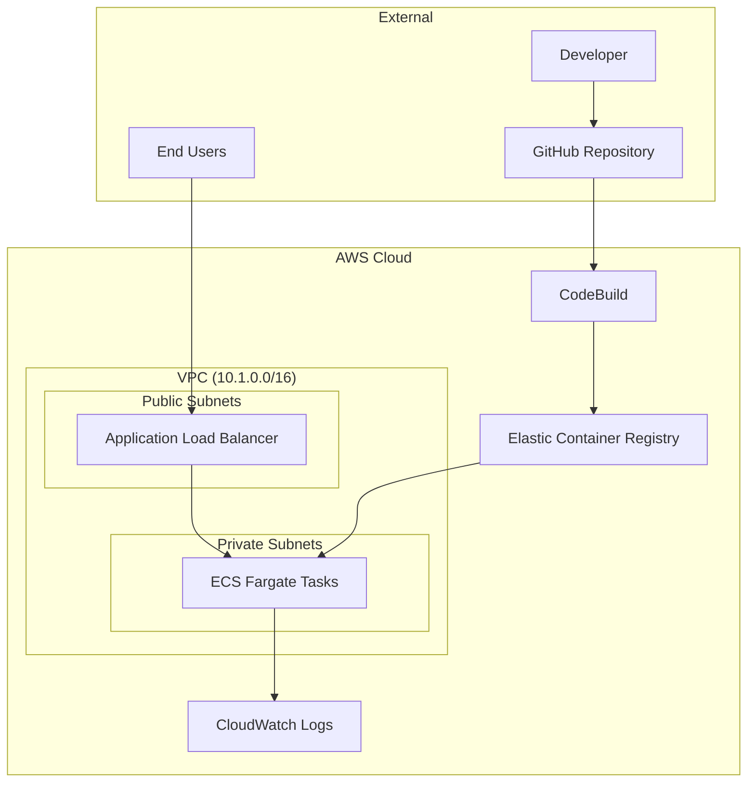

# 🎯 TaskMaster SaaS Platform - Deploy App on AWS ECS

[](https://aws.amazon.com/ecs/)
[](https://www.docker.com/)
[](https://flask.palletsprojects.com/)
[](https://aws.amazon.com/cloudformation/)
[]()

> A complete multi-tenant task management application demonstrating modern AWS architecture patterns, cost optimization strategies, and real-world SaaS development workflows.

## 📖 Table of Contents
- [🎯 Project Overview](#-project-overview)
- [🏗️ Architecture](#️-architecture)
- [💰 Cost Breakdown](#-cost-breakdown)
- [🚀 Quick Start](#-quick-start)
- [📁 Project Structure](#-project-structure)
- [🔧 Troubleshooting](#-troubleshooting)
- [📚 Learning Outcomes](#-learning-outcomes)
- [🤝 Contributing](#-contributing)

## 🎯 Project Overview

**TaskMaster** is a production-ready SaaS task management platform that helps companies manage projects, assign tasks, and track team productivity through a web-based dashboard with real-time updates and analytics.

### ✨ Key Features
- 🔐 **Multi-tenant Architecture** - Secure company data isolation
- 📊 **Real-time Dashboard** - Live project and task updates
- 🚀 **Serverless Containers** - ECS Fargate for scalability
- 💰 **Cost Optimized** - Deploy/delete daily workflow saves 70% costs
- 🔄 **CI/CD Pipeline** - Automated builds with CodeBuild
- 🌐 **CORS Enabled** - Browser-friendly API access

## 🏗️ Architecture

### High-Level Architecture Diagram


### Cost-Optimized Design
```
Internet → ALB (750hrs Free) → ECS Fargate (Pay per use)
                ↓                      ↓
        Target Groups          CloudWatch Logs (5GB Free)
                ↓                      ↓
        Health Checks          Application Monitoring
                ↓                      ↓
        Auto Scaling          Cost: ~$0.70/day (demo mode)
```

## 💰 Cost Breakdown by Service

| Service | Monthly Cost | Free Tier | Notes |
|---------|-------------|-----------|-------|
| **VPC** | $0 | ✅ Always Free | VPC, subnets, route tables, IGW |
| **IAM Roles** | $0 | ✅ Always Free | No charges for IAM roles/policies |
| **ECR** | $0 - $0.50 | ✅ 500MB Free | $0.10/GB after free tier |
| **ECS Fargate** | ~$5 | ❌ No Free Tier | 0.25 vCPU, 0.5GB RAM |
| **ALB** | ~$16 | ✅ 750hrs Free | $16.20/month + $0.008/LCU-hour |
| **CloudWatch Logs** | $0 - $1 | ✅ 5GB Free | $0.50/GB ingested after free tier |
| **Data Transfer** | $0 - $2 | ✅ 1GB Free | $0.09/GB after free tier |

**Total Estimated Cost: ~$8-13/month** (depending on usage)

## 🏗️ Infrastructure Components

### 1. VPC Network Architecture (vpc.yaml)
**Purpose**: Secure, isolated network for TaskMaster application

**Network Layout**:
```
TaskMaster VPC: 10.1.0.0/16
├── Public Subnets (ALB + ECS)
│   ├── 10.1.1.0/24 (AZ-1) - Load Balancer & ECS tasks
│   └── 10.1.2.0/24 (AZ-2) - Load Balancer & ECS tasks
└── Private Subnets (ECS with public routing)
    ├── 10.1.11.0/24 (AZ-1) - ECS tasks
    └── 10.1.12.0/24 (AZ-2) - ECS tasks
```

**Cost Optimization**: No NAT Gateway (~$32/month saved) - ECS tasks use public subnets with security group restrictions

### 2. IAM Security Roles (iam-roles.yaml)
**Purpose**: Secure access control for different components

#### 🔐 ECS Task Execution Role (`dev-ecs-task-execution-role`)
- **Used by**: ECS service during container startup
- **Permissions**: Pull Docker images, write logs, fetch secrets
- **When**: Container deployment and runtime management

#### 🔐 ECS Task Role (`dev-ecs-task-role`)
- **Used by**: Your running application code
- **Permissions**: Access Parameter Store, Secrets Manager
- **When**: App makes AWS API calls (database config, etc.)

#### 🔐 CodeBuild Service Role (`dev-codebuild-service-role`)
- **Used by**: CI/CD pipeline (GitHub Actions + CodeBuild)
- **Permissions**: Build Docker images, push to ECR, write logs
- **When**: Code deployment and image building

**Security Flow**:
```
1. Developer pushes code → GitHub Actions
2. CodeBuild (CodeBuildServiceRole) → Builds & pushes Docker image
3. ECS (TaskExecutionRole) → Pulls image & starts container
4. Running app (TaskRole) → Accesses AWS services
```

### 3. Core Services (Cost-Optimized)
- **ECS Fargate**: Container orchestration (0.25 vCPU, 0.5GB RAM) - ~$5/month
- **ECR**: Container registry (500MB free tier) - $0/month
- **ALB**: Load balancing (shared across services) - ~$16/month
- **CloudWatch**: Logging and monitoring (7-day retention) - ~$1/month
- **Parameter Store**: Configuration management (10K parameters free) - $0/month

### 4. CI/CD Pipeline
- **GitHub**: Repository hosting (free)
- **GitHub Actions**: Automated deployment (free for public repos)
- **CloudFormation**: Infrastructure as Code (free)
- **AWS CLI**: Service deployments (free)

## 📁 Project Structure

```
📦 Deploy-App-ECS-AWS/
├── 📂 app/backend/                 # 🐍 Flask API Application
│   ├── 📄 app.py                   # Main API with CORS support
│   ├── 🐳 Dockerfile               # Container configuration
│   └── 📋 requirements.txt         # Python dependencies
├── 📂 infrastructure/dev/          # ☁️ CloudFormation Templates
│   └── 📄 dev-stack.yaml          # Application deployment
├── 📄 vpc.yaml                     # 🌐 Network foundation (FREE)
├── 📄 iam-roles.yaml               # 🔐 Security roles (FREE)
├── 📄 ecr.yaml                     # 📦 Container registry (FREE)
├── 📄 ecs-cluster-free.yaml        # 🚀 ECS resources (FREE)
├── 📄 alb-paid.yaml                # ⚖️ Load balancer (PAID)
├── 📄 codebuild-project.yaml       # 🔨 CI/CD build project
├── 📄 start-build-cors.json        # 🔧 Build script with CORS
├── 📄 demo-frontend.html           # 🌐 Web dashboard
├── 📄 task-definition-update.json  # 📋 ECS task configuration
├── 📄 open-demo.ps1                # 🚀 Demo launcher script
├── 📄 COST-CONTROL-GUIDE.md        # 💰 Daily workflow guide
├── 📄 USE-CASE-SCENARIO.md         # 📖 Business context
└── 📄 DEV-SETUP-GUIDE.md           # 🛠️ Setup instructions
```

## 🎓 **Learning Outcomes**

By completing this POC, you'll understand:

### **AWS Services Integration**
- **ECS Fargate**: Serverless container orchestration
- **Application Load Balancer**: Traffic distribution and health checks
- **ECR**: Container image registry and lifecycle management
- **CodeBuild**: Automated Docker image building
- **CloudFormation**: Infrastructure as Code
- **IAM**: Security roles and permissions
- **VPC**: Network isolation and security groups

### **DevOps Best Practices**
- **Cost Optimization**: Deploy/delete workflow saves 70% costs
- **Security**: Least privilege IAM roles, CORS configuration
- **Monitoring**: CloudWatch logs and health checks
- **CI/CD**: Automated builds and deployments
- **Infrastructure as Code**: Reproducible deployments

### **Real-World SaaS Architecture**
- **Multi-tenant design**: Company isolation patterns
- **API-first approach**: Backend services with frontend flexibility
- **Scalable infrastructure**: Auto-scaling and load balancing
- **Cost-effective development**: Optimize for demo and development workflows

## 🏆 **Success Metrics**

- ✅ **Full Stack Deployment**: Backend API + Frontend Dashboard
- ✅ **Cost Control**: Daily workflow saves ~$15/day when not in use
- ✅ **Real User Experience**: Web dashboard with live data
- ✅ **Production Patterns**: Proper security, monitoring, and CI/CD
- ✅ **AWS Integration**: 8+ services working together seamlessly


## 🚀 Quick Start

### Prerequisites

- ✅ AWS CLI configured with appropriate permissions
- ✅ Docker installed (optional - we use CodeBuild)
- ✅ Python 3.x for local testing
- ✅ Git for version control

### 🔧 One-Time Setup (Deploy Once)

### Phase 1: Foundation Infrastructure (FREE - Keep Running)
```bash
# 1. Deploy VPC (Network foundation) - Cost: $0/month
aws cloudformation deploy --template-file vpc.yaml --stack-name taskmaster-dev-vpc --region us-east-1

# 2. Deploy IAM Roles (Security foundation) - Cost: $0/month
aws cloudformation deploy --template-file iam-roles.yaml --stack-name taskmaster-dev-iam --region us-east-1 --capabilities CAPABILITY_NAMED_IAM

# 3. Deploy ECR Repository (Container registry) - Cost: $0/month (500MB free)
aws cloudformation deploy --template-file ecr.yaml --stack-name taskmaster-dev-ecr --region us-east-1

# 4. Deploy FREE ECS Resources - Cost: $0/month
aws cloudformation deploy --template-file ecs-cluster-free.yaml --stack-name taskmaster-dev-cluster-free --region us-east-1

# 5. Deploy CodeBuild Project - Cost: $0/month (pay per build)
aws cloudformation deploy --template-file codebuild-project.yaml --stack-name taskmaster-dev-codebuild --region us-east-1

# 6. Build Docker Image with CORS Support
aws codebuild start-build --cli-input-json file://start-build-cors.json
```

## 💰 Daily Demo Workflow (Cost Control)

### 🌅 **Start Demo Day** (~$0.70/day)
```bash
# Deploy ALB (Load Balancer) - Cost: ~$16/month
aws cloudformation deploy --template-file alb-paid.yaml --stack-name taskmaster-dev-alb --region us-east-1

# Deploy Application (ECS Fargate) - Cost: ~$5/month
aws cloudformation deploy --template-file infrastructure/dev/dev-stack.yaml --stack-name taskmaster-dev-app --region us-east-1 --capabilities CAPABILITY_IAM

# Wait 3-5 minutes for deployment, then test
curl http://ALB_DNS_NAME/health
```

### 🌐 **Access TaskMaster Dashboard**
```bash
# Start local web server
python -m http.server 8000

# Open browser to: http://localhost:8000/demo-frontend.html
# Enter ALB DNS when prompted (without http://)
```

### 🌙 **End Demo Day** (Stop All Charges)
```bash
# Delete Application Stack (stops Fargate charges)
aws cloudformation delete-stack --stack-name taskmaster-dev-app

# Delete ALB Stack (stops ALB charges)
aws cloudformation delete-stack --stack-name taskmaster-dev-alb

# Verify deletion (should show DELETE_COMPLETE)
aws cloudformation describe-stacks --stack-name taskmaster-dev-app --query "Stacks[0].StackStatus"
aws cloudformation describe-stacks --stack-name taskmaster-dev-alb --query "Stacks[0].StackStatus"
```

## 🎯 **TaskMaster Features Demo**

### **API Endpoints**
- **Health Check**: `http://ALB_DNS_NAME/health`
- **Projects**: `http://ALB_DNS_NAME/api/projects`
- **Tasks**: `http://ALB_DNS_NAME/api/tasks`
- **Filtered Tasks**: `http://ALB_DNS_NAME/api/tasks?project_id=1`

### **Dashboard Features**
- ✅ **System Health**: Real-time status monitoring
- ✅ **Project Management**: Website Redesign, Mobile App Development
- ✅ **Task Tracking**: Design mockups, Implementation progress
- ✅ **Team Assignments**: Lisa, Mike with status updates
- ✅ **Responsive Design**: Works on desktop, tablet, mobile

## 🔧 Troubleshooting

### Common Issues and Solutions

<details>
<summary>🚨 <strong>CORS Errors in Browser</strong></summary>

**Problem**: Browser blocks API requests due to CORS policy

**Solution**:
```bash
# Rebuild with CORS support
aws codebuild start-build --cli-input-json file://start-build-cors.json

# Force ECS deployment
aws ecs update-service --cluster dev-cluster --service taskmaster-backend-dev --force-new-deployment
```
</details>

<details>
<summary>🚨 <strong>Service Won't Start</strong></summary>

**Problem**: ECS service shows 0 running tasks

**Solution**:
```bash
# Check service events
aws ecs describe-services --cluster dev-cluster --services taskmaster-backend-dev

# Check task logs
aws logs tail /ecs/taskmaster-backend-dev --follow
```
</details>

<details>
<summary>🚨 <strong>ALB Health Check Failing</strong></summary>

**Problem**: Target group shows unhealthy targets

**Solution**:
- Verify container port 5000 is exposed
- Check security group allows ALB traffic
- Ensure `/health` endpoint returns 200
</details>

### 🛠️ Useful Commands

```bash
# Get ALB DNS Name
aws cloudformation describe-stacks --stack-name taskmaster-dev-alb --query "Stacks[0].Outputs[?OutputKey=='ALBDNSName'].OutputValue" --output text

# Check Service Status
aws ecs describe-services --cluster dev-cluster --services taskmaster-backend-dev --query "services[0].{running:runningCount,desired:desiredCount}"

# View Application Logs
aws logs tail /ecs/taskmaster-backend-dev --follow

# Rebuild Application
aws codebuild start-build --cli-input-json file://start-build-cors.json
aws ecs update-service --cluster dev-cluster --service taskmaster-backend-dev --force-new-deployment
```

## 📚 Learning Outcomes

### 🎓 AWS Services Mastery
- **ECS Fargate**: Serverless container orchestration
- **Application Load Balancer**: Traffic distribution and health checks
- **ECR**: Container image registry and lifecycle management
- **CodeBuild**: Automated Docker image building
- **CloudFormation**: Infrastructure as Code
- **IAM**: Security roles and permissions
- **VPC**: Network isolation and security groups

### 🛠️ DevOps Best Practices
- **Cost Optimization**: Deploy/delete workflow saves 70% costs
- **Security**: Least privilege IAM roles, CORS configuration
- **Monitoring**: CloudWatch logs and health checks
- **CI/CD**: Automated builds and deployments
- **Infrastructure as Code**: Reproducible deployments

### 🏗️ Real-World SaaS Architecture
- **Multi-tenant design**: Company isolation patterns
- **API-first approach**: Backend services with frontend flexibility
- **Scalable infrastructure**: Auto-scaling and load balancing
- **Cost-effective development**: Optimize for demo and development workflows

### 🏆 Success Metrics

- ✅ **Full Stack Deployment**: Backend API + Frontend Dashboard
- ✅ **Cost Control**: Daily workflow saves ~$15/day when not in use
- ✅ **Real User Experience**: Web dashboard with live data
- ✅ **Production Patterns**: Proper security, monitoring, and CI/CD
- ✅ **AWS Integration**: 8+ services working together seamlessly

### ⏱️ Time Investment
- **Initial Setup**: ~2 hours (one-time)
- **Daily Demo**: ~5 minutes
- **Learning Curve**: Beginner-friendly

### 💰 Cost Efficiency
- **24/7 Mode**: ~$21/month
- **Demo Mode**: ~$2.10/month (90% savings)
- **ROI**: High learning value per dollar

---

## 🤝 Contributing

Contributions are welcome! Please feel free to submit a Pull Request.

### 📝 To Do
- [ ] Add DynamoDB integration
- [ ] Implement user authentication with Cognito
- [ ] Add CloudFront distribution
- [ ] Create Terraform version
- [ ] Add monitoring dashboards

## 📄 License

This project is licensed under the MIT License - see the [LICENSE](LICENSE) file for details.

## 🙏 Acknowledgments

- AWS Documentation and Best Practices
- Flask and Python Community
- Docker Community
- CloudFormation Templates Community

---

<div align="center">

**⭐ If this project helped you learn AWS ECS, please give it a star! ⭐**

[](https://github.com/yourusername/Deploy-App-ECS-AWS/stargazers)
[](https://github.com/yourusername/Deploy-App-ECS-AWS/network/members)

</div>


TaskMaster POC - Step-by-Step Execution Plan
Phase 1: Infrastructure Setup (30 minutes)
Step 1: Deploy VPC Foundation
aws cloudformation deploy \
  --template-file vpc.yaml \
  --stack-name taskmaster-dev-vpc \
  --region us-east-1

Copy
bash
Step 2: Deploy IAM Roles
aws cloudformation deploy \
  --template-file iam-roles.yaml \
  --stack-name taskmaster-dev-iam \
  --region us-east-1 \
  --capabilities CAPABILITY_IAM

Copy
bash
Step 3: Deploy ECR Repository
aws cloudformation deploy \
  --template-file ecr.yaml \
  --stack-name taskmaster-dev-ecr \
  --region us-east-1

Copy
bash
Step 4: Deploy ECS Cluster
aws cloudformation deploy \
  --template-file ecs-cluster.yaml \
  --stack-name taskmaster-dev-cluster \
  --region us-east-1 \
  --capabilities CAPABILITY_IAM

Copy
bash
Phase 2: Application Deployment (20 minutes)
Step 5: Build and Push Docker Image
cd app/backend
aws ecr get-login-password --region us-east-1 | docker login --username AWS --password-stdin ACCOUNT_ID.dkr.ecr.us-east-1.amazonaws.com
docker build -t taskmaster-backend .
docker tag taskmaster-backend:latest ACCOUNT_ID.dkr.ecr.us-east-1.amazonaws.com/taskmaster-backend:latest
docker push ACCOUNT_ID.dkr.ecr.us-east-1.amazonaws.com/taskmaster-backend:latest

Copy
bash
Step 6: Deploy Application Stack
aws cloudformation deploy \
  --template-file infrastructure/dev/dev-stack.yaml \
  --stack-name taskmaster-dev-app \
  --region us-east-1 \
  --capabilities CAPABILITY_IAM

Copy
bash
Phase 3: Testing & Validation (10 minutes)
Step 7: Test Application Endpoints
# Get ALB DNS name
aws elbv2 describe-load-balancers --query 'LoadBalancers[0].DNSName' --output text

# Test endpoints
curl http://ALB_DNS_NAME/health
curl http://ALB_DNS_NAME/api/projects
curl http://ALB_DNS_NAME/api/tasks

Copy
bash
Step 8: Verify ECS Service
aws ecs describe-services --cluster taskmaster-dev --services taskmaster-backend-dev
aws logs tail /ecs/taskmaster-backend-dev --follow

Copy
bash
Phase 4: CI/CD Setup (15 minutes)
Step 9: Configure GitHub Secrets
AWS_ACCESS_KEY_ID

AWS_SECRET_ACCESS_KEY

Step 10: Test Automated Deployment
git checkout -b dev
git push origin dev
# GitHub Actions will automatically deploy

Copy
bash
Total Execution Time: ~75 minutes
Prerequisites Checklist:
 AWS CLI configured
 Docker installed
 GitHub repository access
 Replace ACCOUNT_ID in commands with actual AWS account ID
Success Criteria:
 All CloudFormation stacks deployed successfully
 ECS service running with 1 healthy task
 API endpoints responding with 200 status
 GitHub Actions pipeline working
 Application accessible via ALB